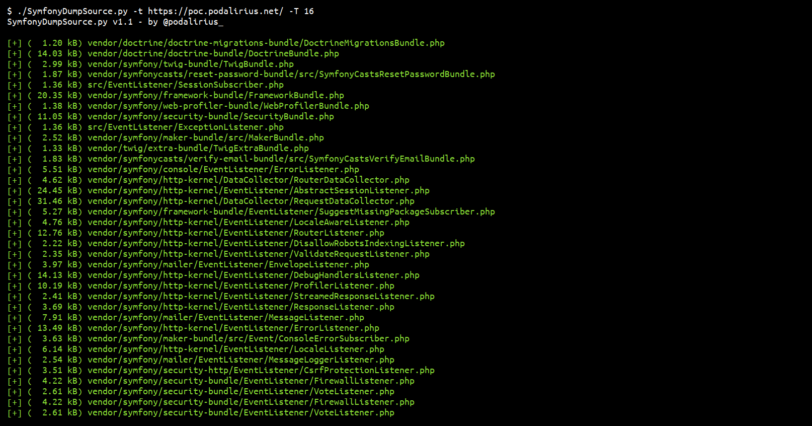

<p align="center">
  A python script to automatically dump files and source code of a Symfony server in debug mode.
  <br>
  
  <a href="https://twitter.com/intent/follow?screen_name=podalirius_" title="Follow"></a>
  <a href="https://www.youtube.com/c/Podalirius_?sub_confirmation=1" title="Subscribe"></a>
  <br>
</p>

## Features

+ [x] Dump files from the remote server in a local directory.
+ [x] Multithreaded.
+ [x] Specify custom list of file paths to dump with option `--file-list`.
+ [x] Automatically extract file paths from debug page

## Demonstration



## Usage

```
$ ./SymfonyDumpSource.py -h
SymfonyDumpSource.py v1.1 - by Remi GASCOU (Podalirius)

usage: SymfonyDumpSource.py [-h] [-v] [--debug] [--no-colors] -t TARGET [-D DUMP_DIR] [-f FILE_LIST] [-T THREADS]

options:
  -h, --help            show this help message and exit
  -v, --verbose         Verbose mode. (default: False)
  --debug               Debug mode.
  --no-colors           No colors mode.
  -t TARGET, --target TARGET
                        Target symfony instance.
  -D DUMP_DIR, --dump-dir DUMP_DIR
                        Directory where the dumped files will be stored.
  -f FILE_LIST, --file-list FILE_LIST
                        File containing symfony paths.
  -T THREADS, --threads THREADS
                        Number of threads (default: 5)
```

## References
 - [https://symfony.com/doc/current/profiler.html](https://symfony.com/doc/current/profiler.html)